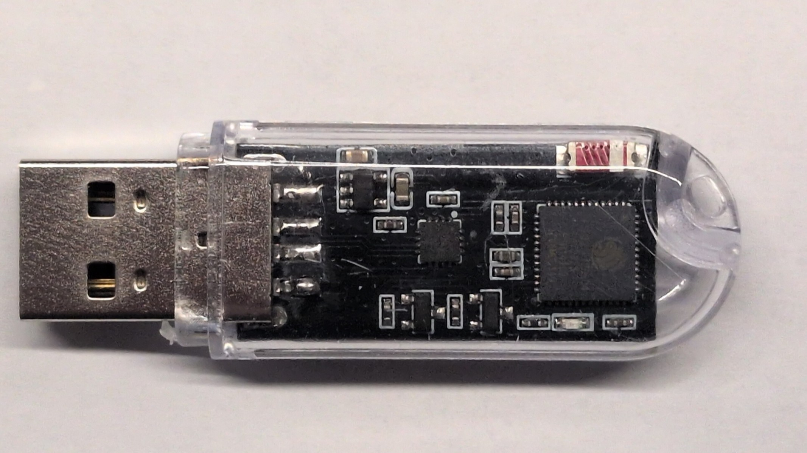

# ESP-OOBM: Wireless Out-of-Band Management Dongle

[](https://platformio.org/)
[](LICENSE)
[](software/include/Config.h)
[-teal.svg)](hardware/schematic.svg)

Open-source wireless Out-of-Band (OOB) serial console bridge for **ESP32-PICO-D4 USB Key (ESP32 KEY V1.0)** with **CH343P USB-to-UART bridge**.

Plug into any router, switch, firewall, or server USB port for emergency root console access over Wi-Fi (WebTerminal / Telnet).

---

## Hardware Overview

| Parameter | Specification |
| :--- | :--- |
| **Board / Form Factor** | ESP32 KEY V1.0 (USB-A Dongle) |
| **SoC / SiP** | ESP32-PICO-D4 (Dual-core 240 MHz, 4 MB embedded flash, QFN-48) |
| **USB-to-UART Bridge** | WCH CH343P (Full-speed USB CDC, hardware rates up to 6 Mbps) |
| **UART Connection** | `GPIO1` (TXD &rarr; CH343P RXD), `GPIO3` (RXD &larr; CH343P TXD) |
| **Status LED** | `GPIO10` (Blue SMD LED `D3`, Active-LOW) |
| **Auto-Reset** | DTR/RTS auto-download dual-transistor circuit (hands-free flashing, no buttons) |
| **Antenna** | 2.4 GHz SMD Ceramic Chip Antenna |
| **Full Hardware Guide**| Detailed photos, schematics & pinout in [`hardware/README.md`](hardware/README.md) |



---

## Quick Start: Build & Flash

### 1. Compile Firmware
```powershell
cd software
pio run -e esp32_pico_d4
```

### 2. Flash via USB
```powershell
pio run -e esp32_pico_d4 -t upload
```

### 3. Initial Wi-Fi Connection
1. Insert dongle into any USB port (powers up in Standalone AP mode).
2. Connect to Wi-Fi: **`ESP-OOBM-XXXXXX`** (Open by default).
3. Open browser: **`http://192.168.4.1/`** (or auto-redirects via Captive Portal).
4. Configure local Wi-Fi or access **Terminal** immediately.

---

## Host Device Console Setup

### MikroTik RouterOS (v7.x)
```routeros
# 1. Verify USB serial port detection
/port print

# 2. Redirect root console to USB dongle (115200 baud)
/system console add port=usb1 channel=0 disabled=no
```

### Linux / OpenWrt / Debian / Ubuntu (`systemd`)
```bash
# 1. Check detected USB serial device
dmesg | grep -i tty
# Output: /dev/ttyCH343USB0 or /dev/ttyUSB0

# 2. Start serial login shell
sudo systemctl enable --now serial-getty@ttyUSB0.service

# 3. (Optional) Kernel boot console in /etc/default/grub:
# GRUB_CMDLINE_LINUX_DEFAULT="console=tty0 console=ttyUSB0,115200n8"
# sudo update-grub
```

### pfSense / FreeBSD / OPNsense
```sh
# Add to /etc/ttys:
ttyU0   "/usr/libexec/getty std.115200"   vt100   on  secure
```

---

## Web Terminal & Telnet Access

| Service | Port / Protocol | URL / Connection Command |
| :--- | :--- | :--- |
| **Web Dashboard** | HTTP (Port 80) | `http://esp-oobm.local/` or `http://192.168.4.1/` |
| **Web ANSI Terminal** | WebSocket (Port 81) | `http://esp-oobm.local/terminal` |
| **Telnet Daemon** | RFC 854 (Port 23) | `telnet 192.168.4.1 23` or `putty -telnet 192.168.4.1 23` |
| **OTA Update** | HTTP (Port 80) | `http://esp-oobm.local/update` |
| **Prometheus Metrics**| HTTP (Port 80) | `http://esp-oobm.local/metrics` |

---

## REST API Endpoints

| Endpoint | Method | Description |
| :--- | :---: | :--- |
| `/api/status` | `GET` | Real-time system stats (CPU, uptime, heap fragmentation, UART byte counters, Wi-Fi RSSI, NTP sync) |
| `/api/logs` | `GET` | Circular in-memory event log buffer (JSON) |
| `/api/scan` | `GET` | Wi-Fi network survey scan results |
| `/api/platform` | `POST` | Store active CLI command platform preset (`p=mikrotik\|linux\|cisco\|pfsense\|generic`) in NVS |
| `/api/settings/save` | `POST` | Save UART baud, framing, NTP timezone, and credentials |
| `/api/wifi/save` | `POST` | Save Station Wi-Fi & AP configuration |
| `/api/restart` | `POST` | Soft reboot device |
| `/api/factory_reset` | `POST` | Clear all NVS configuration and reboot to factory AP defaults |

---

## Repository Structure

```
WiFi-Out-of-Band-Management/
├── README.md                      # Quick documentation & commands
├── LICENSE                        # MIT License
├── hardware/                      # Hardware schematics & pinout
│   ├── README.md                  # Specifications & architecture diagram
│   ├── PINOUT.md                  # Pin mapping table & debug header
│   ├── schematic.svg              # Vector schematic diagram (CAD export)
│   └── schematic.png              # High-resolution raster schematic
└── software/                      # PlatformIO firmware
    ├── platformio.ini             # Build environment (pico32 board)
    ├── partitions_custom.csv      # 4MB dual OTA partition table
    ├── include/                   # Headers (Config, WebPortal, SerialBridge, etc.)
    └── src/                       # C++ source code & WebTerminal
```

---

## License

MIT License. Open for personal, educational, and commercial use.
