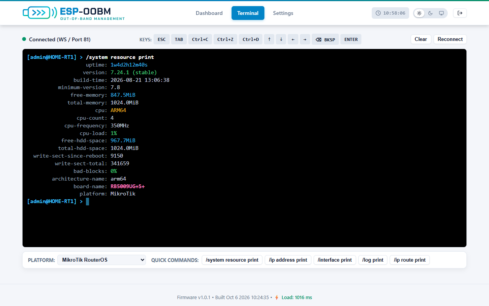
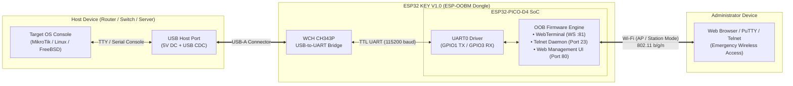
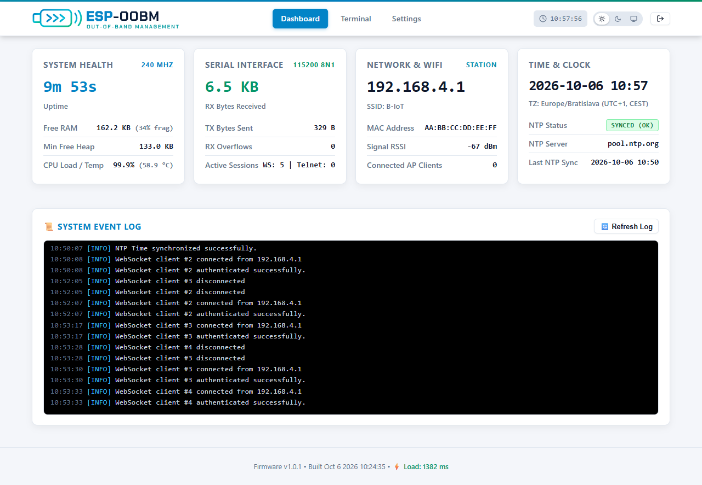

# ESP-OOBM: Wireless Out-of-Band Management Dongle

[](https://platformio.org/)
[](LICENSE)
[](software/include/Config.h)
[](https://stanoba.github.io/ESP-OOBM/webflasher/)
[-teal.svg)](assets/schematic.svg)

Open-source wireless Out-of-Band (OOB) serial console bridge for **ESP32-PICO-D4 USB Key (ESP32 KEY V1.0)** with **CH343P USB-to-UART bridge**.

Plug into any router, switch, firewall, or server USB port for emergency root console access over Wi-Fi (WebTerminal / Telnet).



---

## Hardware Overview

| Parameter | Specification |
| :--- | :--- |
| **Board / Form Factor** | ESP32 KEY V1.0 (USB-A Dongle) |
| **SoC / SiP** | ESP32-PICO-D4 (Dual-core 240 MHz, 4 MB embedded flash, QFN-48) |
| **USB-to-UART Bridge** | WCH CH343P (Full-speed USB CDC, hardware rates up to 6 Mbps) |
| **UART Connection** | `GPIO1` (TXD &rarr; CH343P RXD), `GPIO3` (RXD &larr; CH343P TXD) |
| **Status LED** | `GPIO10` (Blue SMD LED `D3`, Active-LOW) |
| **Auto-Reset** | DTR/RTS auto-download dual-transistor circuit (hands-free flashing, no buttons) |
| **Antenna** | 2.4 GHz SMD Ceramic Chip Antenna |
| **Full Hardware Guide**| Detailed photos, schematics & pinout in [`docs/hardware.md`](docs/hardware.md) |


---

## Operating Principle



---

## Quick Start: Installation & Flashing

### Option A: One-Click Web Installer (No Software Required)
Plug your ESP-OOBM dongle into your computer and flash directly from Chrome, Edge, or Brave:
👉 **[Open ESP-OOBM Web Installer](https://stanoba.github.io/ESP-OOBM/webflasher/)**

---

### Option B: Build & Flash via PlatformIO / CLI

#### 1. Compile Firmware
```powershell
cd software
pio run -e esp32_pico_d4
```

#### 2. Flash via USB
```powershell
pio run -e esp32_pico_d4 -t upload
```

#### 3. Factory Reset (If Access Lost)
```powershell
# Erase all flash memory and re-upload default firmware
pio run -e esp32_pico_d4 -t erase
pio run -e esp32_pico_d4 -t upload
```

#### 4. Run Unit Tests (optional, no hardware)
```powershell
pio test -e native
```

---

### Initial Connection & Access
1. **Wi-Fi Mode**: Connect to **`ESP-OOBM-XXXXXX`** (Password: **`oobmadm123`**), open **`http://192.168.4.1/`** (User: **`admin`**, Pass: **`oobmadm123`**).

---

## Default Security & Network Credentials

| Service / Interface | Protocol / Port | Username | Default Password | Notes |
| :--- | :---: | :---: | :---: | :--- |
| **Wi-Fi Access Point (AP)** | 802.11 b/g/n | — | `oobmadm123` | WPA2-PSK Protected (SSID: `ESP-OOBM-XXXXXX`) |
| **Web Management** | **HTTP (Port 80)** | `admin` | `oobmadm123` | Dashboard, settings, and management API |
| **Captive Portal / HTTP** | **HTTP (Port 80)** | `admin` | `oobmadm123` | Captive portal detection and local management |
| **WebSocket Console** | **WS (Port 81)** | `admin` | `oobmadm123` | WebSocket bridge directly to UART0 |
| **Telnet Daemon** | **Telnet (Port 23)** | — | `oobmadm123` | Password prompt on connection (RFC 854) |
| **Prometheus / REST API** | **HTTP (Port 80)** | `admin` | `oobmadm123` | HTTP Basic Auth & Session Tokens |

> Web credentials can be changed in **Settings &rarr; Web & API Security**.

---

## Web Management Interface

ESP-OOBM features an interactive web console with 16-color ANSI terminal emulation, touch macro keys (`ESC`, `TAB`, `Ctrl+C`, `Ctrl+Z`, `Ctrl+D`), and instant command presets for RouterOS, Linux, Cisco IOS, and pfSense.



> [!TIP]
> For complete dashboard screenshots, dark mode preview, and mobile usage guides, see [`docs/ui-guide.md`](docs/ui-guide.md).

---

## Host Device Console Setup

### MikroTik RouterOS (v7.x)
```routeros
# 1. Verify USB serial port detection
/port print

# 2. View active console configuration
/system console print detail

# 3. Set terminal emulation to xterm on all console ports
/system console set [find] term=xterm

# 4. (Optional) Redirect root console to USB dongle if not attached automatically
/system console add port=usb1 channel=0 term=xterm disabled=no
```

> [!NOTE]
> When logging in via serial/telnet, append `+c` to your username (e.g. `admin+c`) to enable color syntax highlighting in RouterOS CLI.

### Linux / OpenWrt / Debian / Ubuntu (`systemd`)
```bash
# 1. Check detected USB serial device
dmesg | grep -i tty
# Output: /dev/ttyCH343USB0 or /dev/ttyUSB0

# 2. Start serial login shell
sudo systemctl enable --now serial-getty@ttyUSB0.service

# 3. (Optional) Kernel boot console in /etc/default/grub:
# GRUB_CMDLINE_LINUX_DEFAULT="console=tty0 console=ttyUSB0,115200n8"
# sudo update-grub
```

### pfSense / FreeBSD / OPNsense
```sh
# Add to /etc/ttys:
ttyU0   "/usr/libexec/getty std.115200"   vt100   on  secure
```

---

## Web Terminal & Network Services

| Service | Port / Protocol | URL / Connection Command |
| :--- | :--- | :--- |
| **Web Dashboard** | HTTP (Port 80) | `http://esp-oobm.local/` or `http://192.168.4.1/` |
| **Web ANSI Terminal** | WebSocket (Port 81) | `http://esp-oobm.local/terminal` |
| **Telnet Daemon** | RFC 854 (Port 23) | `telnet 192.168.4.1 23` or `putty -telnet 192.168.4.1 23` |
| **OTA Firmware Update**| HTTP (Port 80) | `http://esp-oobm.local/update` |
| **Prometheus Metrics**| HTTP (Port 80) | `http://esp-oobm.local/metrics` |

---

## Documentation & Deep-Dive Guides

Comprehensive technical guides and protocol specifications are available in the [`docs/`](docs/) directory:

| Guide | Description | Document |
| :--- | :--- | :--- |
| 🔌 **Hardware Specifications & Pinout** | ESP32-PICO-D4 SiP, CH343P USB-UART bridge, auto-reset circuit, schematic & BOM | [`docs/hardware.md`](docs/hardware.md) |
| ⚙️ **Software & Firmware Architecture** | C++ core modules, FreeRTOS loop, memory partitions, NVS keys, and OTA updates | [`docs/software.md`](docs/software.md) |
| 💻 **Web Interface & Terminal Guide** | ANSI/VT100 terminal engine, macro buttons, command quick-actions, themes | [`docs/ui-guide.md`](docs/ui-guide.md) |
| 🌐 **REST & WebSocket API** | JSON endpoints (`/api/*`), binary WebSocket protocol (`:81`), Telnet daemon (`:23`) | [`docs/api.md`](docs/api.md) |
| 📊 **Prometheus Exporter & Grafana** | Built-in `/metrics` exporter, Prometheus scrape job, and Grafana PromQL examples | [`docs/prometheus.md`](docs/prometheus.md) |

## Disclaimer

> [!CAUTION]
> **Use at Your Own Risk.**
> This hardware design, schematics, PCB layouts, and firmware are provided **"as is"**, without warranty of any kind, express or implied, including but not limited to the warranties of merchantability, fitness for a particular purpose, and non-infringement.
>
> In no event shall the authors, maintainers, or contributors be held liable for any direct, indirect, incidental, special, exemplary, or consequential damages (including, but not limited to, hardware damage, equipment bricking, data loss, network outages, electrical short circuits, or business interruption) arising in any way out of the fabrication, assembly, flashing, or usage of this project.
>
> Always verify USB pinouts, power ratings, and serial voltage levels before connecting custom hardware dongles to critical production servers, routers, or network appliances.

## License

MIT License. Open for personal, educational, and commercial use.


