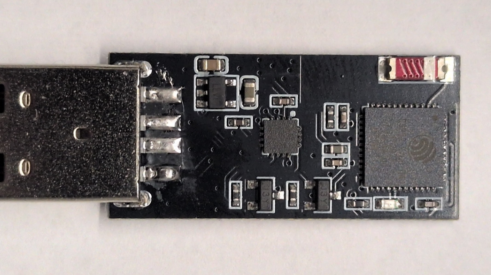

# Hardware Specifications & Pinout Guide

This document provides complete hardware specifications, schematics, pinout assignments, and circuit operation details for the **ESP32 KEY V1.0** USB Out-of-Band Management dongle.

---

## Hardware Gallery

| Enclosure View (Assembled) | Bare PCB Top (Component Layer) | Bare PCB Bottom (Silkscreen Layer) |
| :---: | :---: | :---: |
|  |  |  |

---

## Schematic Diagram

The vector schematic diagram is available in SVG format: [`schematic.svg`](../assets/schematic.svg).

[](../assets/schematic.svg)

---

## Component Architecture & BOM Summary

| Subsystem / IC | Part Number | Package | Description & Role |
| :--- | :--- | :--- | :--- |
| **Microcontroller (SoC/SiP)** | Espressif **ESP32-PICO-D4** | QFN-48 (7×7 mm) | Dual-core 32-bit Xtensa LX6 @ 240 MHz, 520 KB SRAM, integrated 4 MB SPI flash, 2.4 GHz 802.11 b/g/n Wi-Fi + BLE |
| **USB-to-UART Bridge** | WCH **CH343P** | ESSOP-10 | Full-speed USB CDC bridge, baud rates from 50 bps up to 6 Mbps, hardware flow control support, auto-baud |
| **Voltage Regulator (LDO)** | MicrOne **ME6211C33M5G** | SOT-23-5 | High-accuracy LDO regulator converting 5V USB VBUS to 3.3V DC (up to 500 mA output, low ripple) |
| **Auto-Download Circuit** | 2x **S8050** (NPN) | SOT-23 | Transistors `Q1` and `Q2` driven by `DTR` & `RTS` signals from CH343P for hands-free firmware flashing |
| **Status Indicator LED** | Blue SMD 0603 | SMD 0603 | LED `D3` connected to `GPIO10` (Active-LOW, pulled up to 3.3V via 10 kΩ resistor) |
| **Antenna** | 2.4 GHz Ceramic Chip | SMD 3216 | Miniature embedded chip antenna for compact USB dongle enclosure |
| **Host Connector** | USB Type-A Male | Through-Hole / SMD | Direct insertion into target server/router USB host port (5V DC power + serial console interface) |

---

## Pinout & Interconnect Mapping

### ESP32-PICO-D4 GPIO Assignments

| GPIO Pin | Function | Default State | Connected To / Description |
| :--- | :--- | :--- | :--- |
| `GPIO1` | `U0TXD` | OUTPUT (High) | CH343P `RXD` (Transmits serial console data to target router/server) |
| `GPIO3` | `U0RXD` | INPUT | CH343P `TXD` (Receives serial console data from target router/server) |
| `GPIO10` | `STATUS_LED` | OUTPUT (Active-LOW) | Blue SMD LED `D3` (Solid ON = Wi-Fi Connected, Blinking = AP Mode / Booting) |
| `EN` (CHIP_PU) | `RESET` | Pulled HIGH (10 kΩ) | Reset control driven by auto-download circuit (`Q1` collector) |
| `GPIO0` | `BOOT` | Pulled HIGH (10 kΩ) | Boot mode selection driven by auto-download circuit (`Q2` collector) |

### CH343P USB-UART Pinout

| Pin # | Pin Name | Direction | Connected To / Description |
| :---: | :--- | :---: | :--- |
| **1** | `VCC` | Power | 3.3V Power Rail (from ME6211 LDO output) |
| **2** | `UD+` (D+) | I/O | USB Type-A Pin 3 (Data +) |
| **3** | `UD-` (D-) | I/O | USB Type-A Pin 2 (Data -) |
| **4** | `GND` | Power | Ground Reference (Common GND) |
| **5** | `DTR#` | Output | Auto-Reset transistor base network (`Q2` base / `Q1` emitter) |
| **6** | `RTS#` | Output | Auto-Reset transistor base network (`Q1` base / `Q2` emitter) |
| **7** | `TXD` | Output | ESP32 `GPIO3` (`U0RXD`) |
| **8** | `RXD` | Input | ESP32 `GPIO1` (`U0TXD`) |
| **9** | `VIO` | Power | 3.3V I/O Level reference |
| **10**| `NC` | — | Not connected |

---

## Auto-Download Reset Circuit Operation

The ESP-OOBM dongle features hands-free programming without physical buttons using a dual-transistor auto-reset circuit driven by the CH343P modem control lines (`DTR` and `RTS`):

```
DTR ----\______/---- Base Q2 (controls GPIO0)
         \    /
          \  /
           \/
RTS ------/\______-- Base Q1 (controls EN / Reset)
```

### Logic Truth Table

| DTR State | RTS State | `EN` (Reset) | `GPIO0` (Boot) | Resulting Action |
| :---: | :---: | :---: | :---: | :--- |
| **HIGH (1)** | **HIGH (1)** | HIGH (1) | HIGH (1) | Normal Operation / Running |
| **LOW (0)** | **HIGH (1)** | HIGH (1) | LOW (0) | Enter Bootloader (ROM Download Mode) |
| **HIGH (1)** | **LOW (0)** | LOW (0) | HIGH (1) | Chip Hard Reset |
| **LOW (0)** | **LOW (0)** | HIGH (1) | HIGH (1) | Disallowed / Inactive (No reset) |

> [!NOTE]
> This dual-transistor configuration prevents accidental resets when terminal software asserts both `DTR` and `RTS` simultaneously upon connection.

---

## Power Supply & Thermal Characteristics

1. **VBUS Input**: Powered directly from the host device USB Type-A port (4.75V – 5.25V DC).
2. **Current Consumption**:
   - Idle (Wi-Fi connected, no active stream): ~85 mA @ 5V (~425 mW)
   - Active Wi-Fi WebTerminal streaming: ~140 mA @ 5V (~700 mW)
   - Wi-Fi RF TX bursts (AP Mode / Scan): Peak ~260 mA @ 5V (~1.3 W)
3. **Thermal Management**: The embedded ME6211 LDO and ESP32-PICO-D4 utilize internal PCB copper planes for heat dissipation. Operating temperature range is -20°C to +70°C.
