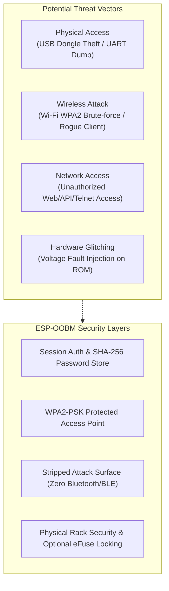

# Security Assessment & Hardening Guide

This document outlines the security architecture, hardware threat model, known silicon vulnerabilities of the **ESP32-PICO-D4**, and practical hardening guidelines for deploying **ESP-OOBM** in production data centers, server rooms, and remote branch sites.

---

## 1. Threat Model & Operational Context

ESP-OOBM acts as an emergency root console bridge connected directly to the serial UART of target routers, switches, firewalls, and servers.



---

## 2. Hardware & Silicon Vulnerabilities (ESP32-PICO-D4)

ESP-OOBM is built on the **ESP32-PICO-D4** System-in-Package (SiP), which integrates a dual-core Xtensa LX6 MCU and 4 MB SPI flash inside a single QFN-48 package.

### A. Voltage Glitching / Fault Injection (CVE-2019-15894)
* **Risk Description**: The classic ESP32 silicon ROM bootloader is susceptible to power rail voltage glitching (nanosecond power drops during boot). Security researchers (*LimitedResults, Raelize*) demonstrated that voltage glitching can bypass Secure Boot v1 and Flash Encryption signature validation.
* **Mitigation**: ESP-OOBM relies on physical security (locked server racks). For high-security environments, ensure physical access to the USB port is restricted.
* **SiP Advantage**: Because the ESP32-PICO-D4 houses the SPI flash silicon die internally inside the sealed epoxy package, physical probing of SPI flash clock/data lines with logic analyzers is significantly more difficult than on discrete ESP32 modules (ESP-WROOM-32).

### B. Unprotected UART Flash Readout (Default Mode)
* **Risk Description**: By default on development boards, the ESP32 ROM enters UART Download Mode when DTR/RTS signals are asserted, allowing anyone with physical access to dump flash memory using:
  ```powershell
  esptool.py --chip esp32 read_flash 0x0 0x400000 firmware_dump.bin
  ```
* **Impact**: An attacker who physically steals the dongle can extract NVS configuration (stored Wi-Fi credentials and hashed passwords).
* **Hardening**: For sensitive production environments, permanently burn the eFuse `UART_DOWNLOAD_DIS` (see [Hardware Hardening](#5-advanced-hardware-hardening-efuses) below).

---

## 3. Network & Protocol Security Architecture

### A. Wi-Fi & Wireless Isolation
* **Access Point (AP)**: Protected by WPA2-PSK (AES-CCMP). Default SSID `ESP-OOBM-XXXXXX` and password `oobmadm123`.
* **Zero Bluetooth Footprint**: The Bluetooth/BLE controller and stack are **completely disabled and excluded from compilation**. This completely eliminates exposure to known ESP32 Bluetooth vulnerabilities such as **BrakTooth** (CVE-2021-28139) and **SweynTooth**.
* **Station Mode Security**: When connecting to an upstream infrastructure network, ESP-OOBM supports WPA2-PSK with DHCP or static IP configuration.

### B. Plaintext Network Traffic & Lack of TLS (Cleartext Risk)

> [!WARNING]
> **ESP-OOBM does NOT implement TLS/HTTPS (`https://`, `wss://`, or SSH/TLS-wrapped Telnet)**. All web traffic (Port 80), WebSocket terminal streams (Port 81), and Telnet connections (Port 23) operate in **unencrypted plaintext** at the application layer.

#### Why TLS is Excluded by Design:
1. **Memory Conservation**: Maintaining TLS sessions (RSA/ECDSA handshakes, cryptographic buffers) consumes 35–50 KB of dynamic heap memory per client on the ESP32, severely impacting stability and concurrent sessions.
2. **Ultra-Low Latency Streaming**: Unencrypted WebSocket packets ensure instantaneous, zero-overhead byte forwarding between UART0 and the browser console.
3. **Air-Gapped & Offline Usability**: Eliminates SSL/TLS certificate validation failures, expired CA trust stores, and domain name dependencies when operating completely offline in standalone AP mode (`192.168.4.1`).

#### Threat Vectors & Eavesdropping Risks:
* **Credential & Password Sniffing**: Login passwords, HTTP basic authentication headers, session cookies, and Telnet authentication passwords travel across the network in cleartext.
* **Console Session Interception**: Keystrokes, router configuration commands, root credentials entered into the target serial console, and router outputs can be captured by anyone with packet sniffing capabilities on the same Layer-2 broadcast domain (e.g. via ARP spoofing, promiscuous mode, or port mirroring).

#### Mandatory Network Hardening:
* **Direct AP Mode (Recommended for Emergency Access)**: When connecting directly to the dongle's Wi-Fi Access Point (`ESP-OOBM-XXXXXX`), the entire wireless link is fully encrypted at Layer 2 via **WPA2-PSK (AES-CCMP)**, protecting passwords from over-the-air sniffing.
* **Station Mode on Dedicated OOB VLANs Only**: If connecting ESP-OOBM to an upstream network in Station Mode, place it strictly on an **isolated Out-of-Band Management VLAN** with Layer-2 isolation (Private VLAN / Client Isolation). **Never connect ESP-OOBM to a shared user network or public subnet**.
* **Remote Access via Encrypted VPN**: Never forward Ports 80, 81, or 23 directly to the internet. Remote administrators must connect through an encrypted VPN tunnel (WireGuard, IPsec, OpenVPN) or an SSH bastion host before accessing the OOBM web portal.

### C. Web Management & WebSocket Security
* **Authentication**: All endpoints (`/`, `/terminal`, `/settings`, `/wifi`, `/api/*`) require authentication.
* **Session Management**: Authenticated requests use session cookies with randomized session tokens and activity timeouts.
* **Brute-Force Resistance**: Authentication attempts validate against salted hashes in NVS.

### D. Telnet Daemon (Port 23)
* **RFC 854 Protocol**: Standard Telnet does not encrypt traffic in transit.
* **Access Control**: Telnet requires password authentication upon connection before dropping into the serial bridge.
* **Operational Recommendation**: Use Telnet only over the direct, encrypted WPA2 Wi-Fi AP connection or an isolated management VLAN. For public or shared networks, use the WebTerminal via browser.

---

## 4. Production Hardening Checklist

Follow these best practices prior to deploying ESP-OOBM in production:

- [ ] **Change Default Passwords**: Change both the **Wi-Fi AP password** and the **Web & Telnet login password** in **Settings &rarr; Web & API Security**. Never leave `oobmadm123` active.
- [ ] **Physical Security**: Keep dongles inside locked server racks or network cabinets with access control.
- [ ] **Isolate Management VLAN**: If configuring Station Mode, connect ESP-OOBM exclusively to an isolated Out-of-Band (OOB) management subnet without direct internet routing.
- [ ] **Firmware Verification**: Always verify SHA-256 checksums from the official [GitHub Releases](https://github.com/stanoba/ESP-OOBM/releases) before flashing.
- [ ] **NTP Synchronization**: Enable NTP time synchronization to ensure event log timestamps are accurate for security audits.

---

## 5. Advanced Hardware Hardening (eFuses)

> [!CAUTION]
> Burning eFuses is **permanent and irreversible**. Once `UART_DOWNLOAD_DIS` is burned, firmware can only be updated over-the-air (OTA via Web UI) and cannot be reflashed via USB cable.

For high-security zero-trust installations, administrators can lock down the hardware using `espefuse.py`:

```powershell
# 1. Check current eFuse status
espefuse.py --chip esp32 summary

# 2. (Optional / Irreversible) Disable UART ROM download mode to prevent physical flash dumps
espefuse.py --chip esp32 burn_efuse UART_DOWNLOAD_DIS

# 3. (Optional / Irreversible) Permanently disable JTAG debugging
espefuse.py --chip esp32 burn_efuse JTAG_DISABLE
```

---

## 6. Reporting Security Vulnerabilities

If you discover a security vulnerability in ESP-OOBM, please report it responsibly by opening a **Private Security Advisory** on GitHub:
👉 **[Report a Security Advisory](https://github.com/stanoba/ESP-OOBM/security/advisories/new)**

Please include:
* Description of the vulnerability and attack vector
* Affected firmware version
* Reproducible proof-of-concept steps or payload
