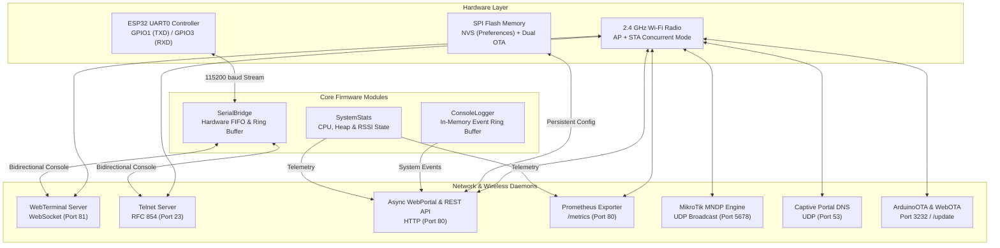

# Software & Firmware Architecture Guide

This document provides a comprehensive breakdown of the firmware architecture, FreeRTOS tasks, C++ modules, memory partitions, and network services of the **ESP-OOBM** wireless console bridge.

---

## 1. System Architecture



---

## 2. Firmware Modules & Source Files

All firmware source code is located in the [`software/`](../software/) directory.

| Module | Header | Implementation | Description |
| :--- | :--- | :--- | :--- |
| **SerialBridge** | [`SerialBridge.h`](../software/include/SerialBridge.h) | [`SerialBridge.cpp`](../software/src/SerialBridge.cpp) | Manages non-blocking hardware UART0 communication, FIFO drain, baud rate configuration, parity, stop bits, and TX/RX byte accounting. |
| **WebTerminal** | [`WebTerminal.h`](../software/include/WebTerminal.h) | [`WebTerminal.cpp`](../software/src/WebTerminal.cpp) | WebSocket server on port 81 providing full-duplex ANSI terminal bridging with platform quick-command macro expansion and session history. |
| **TelnetServer** | [`TelnetServer.h`](../software/include/TelnetServer.h) | [`TelnetServer.cpp`](../software/src/TelnetServer.cpp) | Standalone RFC 854 Telnet daemon on port 23 supporting multiple concurrent clients, password authentication, and NVT control negotiation. |
| **WebPortal** | [`WebPortal.h`](../software/include/WebPortal.h) | [`WebPortal.cpp`](../software/src/WebPortal.cpp) | HTTP web server serving the responsive dark/light management UI, Captive Portal DNS redirection, and JSON REST API (`/api/*`). |
| **PrometheusExporter** | [`PrometheusExporter.h`](../software/include/PrometheusExporter.h) | [`PrometheusExporter.cpp`](../software/src/PrometheusExporter.cpp) | Standard OpenMetrics HTTP exporter endpoint on `/metrics` with uptime, RAM, CPU load, Wi-Fi RSSI, and serial I/O telemetry. |
| **MndpDiscovery** | [`MndpDiscovery.h`](../software/include/MndpDiscovery.h) | [`MndpDiscovery.cpp`](../software/src/MndpDiscovery.cpp) | Broadcasts MikroTik Neighbor Discovery Protocol (MNDP) UDP packets every 60s for automatic device discovery in MikroTik Winbox. |
| **ConsoleLogger** | [`ConsoleLogger.h`](../software/include/ConsoleLogger.h) | [`ConsoleLogger.cpp`](../software/src/ConsoleLogger.cpp) | In-memory circular log buffer holding the last 100 system events with ISO 8601 timestamps and severity levels (INFO, WARN, ERROR). |
| **SystemStats** | [`SystemStats.h`](../software/include/SystemStats.h) | [`SystemStats.cpp`](../software/src/SystemStats.cpp) | Calculates real-time CPU load estimations, heap fragmentation index, minimum free heap, uptime, and Wi-Fi signal quality. |
| **VectorGraphics** | [`VectorGraphics.h`](../software/include/VectorGraphics.h) | Header-only (PROGMEM) | Statically stored pure SVG vector paths (Logo, Favicon) with zero dynamic RAM allocation and 100% offline AP-mode readiness. |
| **WebUtils** | [`WebUtils.h`](../software/include/WebUtils.h) | Header-only (inline) | Hardware-independent URL decoding and form/JSON/multipart argument parsing used by WebPortal; covered by native unit tests. |

---

## 3. Flash Memory & Partition Layout

The ESP32-PICO-D4 includes 4 MB (4096 KB) embedded SPI flash. The partitioning scheme is configured in [`partitions_custom.csv`](../software/partitions_custom.csv):

```
# ESP32 Custom 4MB Partition Table with Dual OTA
# Name,   Type, SubType,  Offset,    Size,     Flags
nvs,      data, nvs,      0x9000,    0x5000,
otadata,  data, ota,      0xe000,    0x2000,
app0,     app,  ota_0,    0x10000,   0x1E0000,
app1,     app,  ota_1,    0x1F0000,  0x1E0000,
coredump, data, coredump, 0x3D0000,  0x30000,
```

### Partition Map Breakdown

| Partition | Offset | Size | Purpose |
| :--- | :---: | :---: | :--- |
| **`nvs`** | `0x009000` | 20 KB | Non-Volatile Storage for runtime preferences (SSID, passwords, baud rate, hostname) |
| **`otadata`** | `0x00E000` | 8 KB | OTA boot selector tracking active vs. pending update partitions |
| **`app0`** | `0x010000` | 1920 KB | Primary firmware slot (Active / Rollback) |
| **`app1`** | `0x1F0000` | 1920 KB | Secondary firmware slot (Seamless OTA target) |
| **`coredump`** | `0x3D0000` | 192 KB | ESP-IDF crash dump storage |

---

## 4. Network Daemons & Services

| Service | Protocol / Transport | Port / Channel | Authentication | Notes |
| :--- | :--- | :---: | :--- | :--- |
| **Web Dashboard** | HTTP (1.1) | `80` | Form Login / Session Cookie | Responsive dashboard, logs, and configuration portal |
| **WebTerminal** | WebSocket (Binary / Text) | `81` | Inherits Web Session Cookie | Full-duplex bidirectional ANSI serial console stream |
| **Telnet Daemon** | RFC 854 (TCP) | `23` | Password Challenge Prompt | Standalone terminal client access (PuTTY, Linux `telnet`) |
| **Prometheus Exporter** | HTTP (`GET /metrics`) | `80` | HTTP Basic Auth | OpenMetrics format telemetry scraper endpoint |
| **Captive Portal DNS** | DNS (UDP) | `53` | None | Wildcard DNS answering `192.168.4.1` for standalone AP mode |
| **MikroTik MNDP** | UDP Broadcast | `5678` | None | Winbox discovery broadcasts on `255.255.255.255` |
| **ArduinoOTA** | TCP / Custom | `3232` | Digest Hash | Wireless flash uploading directly from PlatformIO CLI |

---

## 5. Non-Volatile Storage (NVS) Configuration Keys

All settings are persisted across reboots in ESP32 NVS using the Arduino `Preferences` library (`NVS_NAMESPACE = "oobm_cfg"`):

| NVS Key Constant | Key String | Data Type | Default Value | Description |
| :--- | :--- | :---: | :--- | :--- |
| `NVS_KEY_WIFI_SSID` | `"sta_ssid"` | String | `""` | Station Wi-Fi network SSID |
| `NVS_KEY_WIFI_PASS` | `"sta_pass"` | String | `""` | Station Wi-Fi network WPA2 password |
| `NVS_KEY_WIFI_DHCP` | `"sta_dhcp"` | Bool | `true` | Use DHCP (`true`) or Static IP (`false`) |
| `NVS_KEY_WIFI_IP` | `"sta_ip"` | String | `"192.168.1.50"` | Static IP address (when DHCP disabled) |
| `NVS_KEY_WIFI_GW` | `"sta_gw"` | String | `"192.168.1.1"` | Gateway IP address |
| `NVS_KEY_WIFI_SN` | `"sta_sn"` | String | `"255.255.255.0"`| Subnet mask |
| `NVS_KEY_WIFI_DNS` | `"sta_dns"` | String | `"1.1.1.1"` | Primary DNS server |
| `NVS_KEY_AP_SSID` | `"ap_ssid"` | String | `"ESP-OOBM-XXXXXX"`| Fallback Access Point SSID (auto-generated from MAC) |
| `NVS_KEY_AP_PASS` | `"ap_pass"` | String | `"oobmadm123"` | Fallback Access Point WPA2 passphrase |
| `NVS_KEY_AP_CHAN` | `"ap_chan"` | UChar | `1` | Wi-Fi Access Point radio channel (1–13) |
| `NVS_KEY_AP_HIDDEN` | `"ap_hidden"`| Bool | `false` | Hide AP SSID beacon broadcast |
| `NVS_KEY_AUTH_EN` | `"auth_en"` | Bool | `true` | Enable Web Portal & API authentication |
| `NVS_KEY_AUTH_USER` | `"auth_user"`| String | `"admin"` | Web Portal & REST API username |
| `NVS_KEY_AUTH_PASS` | `"auth_pass"`| String | `"oobmadm123"` | Web Portal & REST API password |
| `NVS_KEY_TELNET_EN` | `"tel_en"` | Bool | `true` | Enable standalone Telnet daemon on port 23 |
| `NVS_KEY_TELNET_PASS` | `"tel_pass"`| String | `"oobmadm123"` | Telnet login challenge password |
| `NVS_KEY_SER_BAUD` | `"ser_baud"` | UInt | `115200` | UART0 baud rate (300 to 921600 bps) |
| `NVS_KEY_SER_DBITS` | `"ser_dbits"`| UChar | `8` | Data bits (7, 8) |
| `NVS_KEY_SER_PARITY` | `"ser_parity"`| UChar | `0` (None) | Parity (`0`=None, `1`=Odd, `2`=Even) |
| `NVS_KEY_SER_SBITS` | `"ser_sbits"`| UChar | `1` | Stop bits (1, 2) |
| `NVS_KEY_HOSTNAME` | `"hostname"` | String | `"esp-oobm-XXXX"` | Device hostname for mDNS and MNDP |
| `NVS_KEY_NTP_ENABLED` | `"ntp_en"` | Bool | `true` | Automatic SNTP time synchronization |
| `NVS_KEY_NTP_SERVER` | `"ntp_srv"` | String | `"pool.ntp.org"` | Primary NTP server hostname |
| `NVS_KEY_NTP_TZ_POSIX`| `"ntp_tz"` | String | `"CET-1CEST,M3.5.0,M10.5.0/3"` | POSIX timezone string (Default: Europe/Bratislava) |

---

## 6. Building & Flashing

### Requirements
* [PlatformIO Core (CLI)](https://docs.platformio.org/en/latest/core/index.html) or PlatformIO IDE.
* Espressif 32 platform package (`^6.12.0`).

### Compilation & Flash Commands
```powershell
# Navigate to software directory
cd software

# Compile firmware binary
pio run -e esp32_pico_d4

# Flash firmware via USB (CH343P auto-reset handled automatically)
pio run -e esp32_pico_d4 -t upload

# Open serial monitor for initial debug output
pio device monitor -b 115200
```

### Over-The-Air (OTA) Updates
1. **Web OTA**: Navigate to `http://192.168.4.1/update` in your browser and upload `.pio/build/esp32_pico_d4/firmware.bin`.
2. **ArduinoOTA (CLI)**:
   ```powershell
   pio run -e esp32_pico_d4 -t upload --upload-port 192.168.1.150
   ```

---

## 7. Factory Reset & Emergency Recovery

If configuration settings or administrative passwords are lost, the device can be returned to default factory settings using **PlatformIO** or **`esptool.py`** via USB without needing to press any hardware buttons.

### Method 1: Full Flash Erase via PlatformIO (Recommended)
This clears the entire flash chip (including all NVS preferences) and flashes a fresh build:
```powershell
cd software

# 1. Erase all Flash memory
pio run -e esp32_pico_d4 -t erase

# 2. Upload fresh firmware
pio run -e esp32_pico_d4 -t upload
```

### Method 2: Fast NVS Partition Erase via `esptool.py` (Preserves Firmware)
To clear ONLY settings and passwords while keeping the existing firmware intact:
```powershell
python -m esptool --chip esp32 erase_region 0x9000 0x5000
```

### Post-Reset Default Credentials
After a factory reset, the device boots in standalone Access Point mode:
* **Wi-Fi SSID**: `ESP-OOBM-XXXXXX` (Password: `oobmadm123`)
* **Web UI URL**: `http://192.168.4.1/` (User: `admin`, Password: `oobmadm123`)
* **Telnet Console**: Port `23` (Password: `oobmadm123`)
