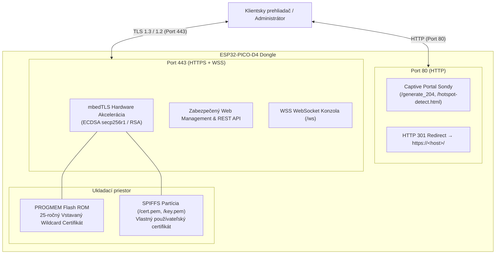

# 🔐 TLS / HTTPS Bezpečnostná Architektúra a Správa Certifikátov

Tento dokument poskytuje detailný návod na konfiguráciu, generovanie a správu **TLS / HTTPS (Port 443)** a **WebSocket Secure (WSS na `/ws`)** pre bezdrôtový dongle **ESP-OOBM**.

---

## 1. Prehľad Bezpečnosti a Architektúra

ESP-OOBM slúži ako záchranná bezdrôtová konzola (Out-of-Band Management) pre sieťové prvky (MikroTik, Cisco, Linux, pfSense). Keďže prenáša citlivé údaje ako administrátorské heslá, prístupové tokeny a interaktívny terminál po Wi-Fi sieti, **šifrovanie komunikácie je kľúčové**.



### Hlavné bezpečnostné výhody:
1. **Ochrana pred sniffingom**: Všetok sieťový prenos medzi prehliadačom a ESP32 je šifrovaný pomocou TLS (mbedTLS). Útočník na rovnakej Wi-Fi sieti (ani v promiscuous móde) nedokáže odchytiť heslá ani stlačené klávesy.
2. **Hardvérová akcelerácia**: ESP32 obsahuje dedikované kryptografické inštrukcie pre AES, SHA a ECC (Elliptic Curve Cryptography), vďaka čomu TLS nespomaľuje odozvu webového terminálu ani beh zariadenia.
3. **Duálny systém certifikátov**:
   - **Vstavaný certifikát (Flash ROM)**: 25-ročná platnosť, funguje ihneď po vybalení bez akejkoľvek konfigurácie.
   - **Vlastný certifikát (SPIFFS)**: Možnosť nahrať vlastný certifikát (napr. Let's Encrypt, firemná CA, vlastný OpenSSL certifikát).
4. **Okamžitá obnova (Fail-Safe)**: V prípade chyby vo vlastnom certifikáte je možné jedným kliknutím vo Web UI obnoviť predvolený certifikát z flash pamäte.

---

## 2. Predvolený Vstavaný Wildcard Certifikát

Firmvér obsahuje predgenerovaný certifikát a privátny kľúč uložený priamo v pamäti Flash ROM (`software/include/DefaultCert.h`).

| Parameter | Hodnota |
| :--- | :--- |
| **Typ kľúča** | **ECDSA (NIST P-256 / secp256r1)** |
| **Veľkosť kľúča** | 256-bit (rovnocenné ~3072-bit RSA pri zlomku RAM a CPU záťaže) |
| **Algoritmus podpisu** | SHA-256 s ECDSA (ecdsa-with-SHA256) |
| **Bežné meno (CN)** | `*.local` |
| **Vystaviteľ (Issuer)** | `ESP-OOBM Firmware Root CA` |
| **Doba platnosti** | **25 Rokov** (2026-10-05 až 2051-10-05) |
| **Alternatívne mená (SANs)** | `*.local`, `*.lan`, `*.internal`, `esp-oobm`, `esp-oobm.local`, `192.168.4.1` |
| **Umiestnenie** | PROGMEM (Flash ROM &ndash; nedá sa zmazať ani poškodiť) |

### Pregenerovanie predvoleného certifikátu pred kompiláciou
Ak chcete vygenerovať nový vstavaný certifikát pre váš vlastný build firmvéru, spustite priložený Python skript:
```powershell
python software/tools/generate_default_cert.py
```
Skript automaticky vytvorí nový privátny kľúč, vygeneruje 25-ročný certifikát so všetkými SAN doménami a aktualizuje súbor [`software/include/DefaultCert.h`](software/include/DefaultCert.h).

---

## 3. Nahratie Vlastného Certifikátu cez Web UI

Vlastný certifikát môžete nahrať priamo cez webové rozhranie bez potreby rekompilácie firmvéru:

1. Prihláste sa do Web UI a prejdite na záložku **Settings** (`/settings`).
2. V sekcii **🔐 TLS / HTTPS Security & Certificates** kliknite na tlačidlo **"Upload Custom TLS Certificate"**.
3. Vložte:
   - **Certificate PEM**: Váš certifikát (alebo celý reťazec `fullchain.pem`).
   - **Private Key PEM**: Váš nezašifrovaný privátny kľúč (`privkey.pem`).
4. Kliknite na **"Install & Activate Certificate"**.
5. Firmvér overí X.509 formát a platnosť pomocou knižnice mbedTLS. Ak je formát v poriadku, uloží súbory do partície SPIFFS (`/cert.pem` a `/key.pem`) a reštartuje zabezpečený server.

### Obnova predvoleného certifikátu
Ak je aktívny vlastný certifikát, v nastaveniach sa zobrazí tlačidlo **"↺ Revert to Firmware Default Certificate"**. Po kliknutí sa súbory certifikátu zo SPIFFS odstránia a webserver sa okamžite vráti k vstavanému 25-ročnému wildcard certifikátu.

---

## 4. Generovanie Vlastných Certifikátov

### Formát: Samostatný certifikát vs. Full Chain
> [!IMPORTANT]
> Pri použití certifikačných autorít ako **Let's Encrypt** alebo verejných komerčných autorít (DigiCert, Sectigo) **vždy nahrajte celý reťazec (`fullchain.pem`)**.
> Reťazec obsahuje váš certifikát servera nasledovaný medzivládnymi autoritami (Intermediate CA). Ak by ste nahrali len samotný koncový certifikát (`cert.pem`), moderné prehliadače by zobrazili chybu `SEC_ERROR_UNKNOWN_ISSUER`.

---

### Metóda A: Let's Encrypt cez Certbot (DNS-01 Overenie)

Pre reálnu doménu (napr. `oobm.vasadomena.sk` alebo `*.oobm.vasadomena.sk`) môžete získať celosvetovo dôveryhodný certifikát zadarmo bez toho, aby bol ESP32 vystavený do internetu (využíva sa DNS TXT záznam):

```bash
# 1. Spustite certbot v manuálnom DNS móde
certbot certonly --manual --preferred-challenges dns -d "oobm.vasadomena.sk"

# 2. Certbot vás vyzve vytvoriť DNS TXT záznam:
# _acme-challenge.oobm.vasadomena.sk s danou hodnotou

# 3. Po overení certbot vygeneruje súbory v /etc/letsencrypt/live/oobm.vasadomena.sk/:
# - fullchain.pem  -> Skopírujte do poľa Certificate vo Web UI
# - privkey.pem    -> Skopírujte do poľa Private Key vo Web UI
```

---

### Metóda B: OpenSSL ECDSA Self-Signed Wildcard Certifikát (Odporúčané pre lokálnu sieť)

ECC certifikáty sú rýchle, malé a ideálne pre mikrokontroléry ESP32.

```bash
# 1. Vygenerovanie ECDSA privátneho kľúča (krivka prime256v1 / secp256r1)
openssl ecparam -name prime256v1 -genkey -noout -out esp_key.pem

# 2. Vygenerovanie 10-ročného self-signed certifikátu s vlastnými SAN doménami
openssl req -new -x509 -key esp_key.pem -out esp_cert.pem -days 3650 \
  -subj "/C=SK/O=MyLab/CN=esp-oobm.local" \
  -addext "subjectAltName=DNS:esp-oobm.local,DNS:*.local,DNS:*.lan,DNS:*.internal,IP:192.168.4.1,IP:192.168.1.50"

# 3. Skontrolujte vygenerovaný certifikát
openssl x509 -in esp_cert.pem -text -noout
```

Obsah súboru `esp_cert.pem` vložte do poľa **Certificate** a obsah `esp_key.pem` do poľa **Private Key**.

---

### Metóda C: OpenSSL RSA Certifikát (2048-bit)

Ak preferujete tradičný RSA certifikát:

```bash
openssl req -x509 -nodes -days 3650 -newkey rsa:2048 \
  -keyout esp_rsa_key.pem -out esp_rsa_cert.pem \
  -subj "/C=SK/O=MyNetwork/CN=esp-oobm.local" \
  -addext "subjectAltName=DNS:esp-oobm.local,DNS:*.lan,IP:192.168.4.1"
```

---

## 5. Inštalácia a Dôvera Certifikátu v Prehliadačoch a OS

Pri použití self-signed certifikátov (vrátane predvoleného vstavaného certifikátu) prehliadače štandardne zobrazia bezpečnostné varovanie (*"Your connection is not private"* / *NET::ERR_CERT_AUTHORITY_INVALID*), pretože autorita nie je v globálnom zozname verejných CA.

Aby ste toto varovanie odstránili natrvalo:

### Windows (Chrome, Edge, Firefox)
1. Exportujte / stiahnite `esp_cert.pem` (alebo skopírujte text certifikátu a uložte ako `esp-oobm.crt`).
2. Dvakrát kliknite na súbor `esp-oobm.crt` &rarr; kliknite na **"Install Certificate..."** (Nainštalovať certifikát).
3. Zvoľte **"Local Machine"** (alebo Current User) &rarr; **Next**.
4. Zvoľte **"Place all certificates in the following store"** (Umiestniť všetky certifikáty do nasledujúceho úložiska) &rarr; kliknite na **Browse**.
5. Vyberte **"Trusted Root Certification Authorities"** (Dôveryhodné koreňové certifikačné autority) &rarr; **OK** &rarr; **Next** &rarr; **Finish**.
6. Reštartujte prehliadač. Stránka `https://esp-oobm.local/` sa teraz otvorí s bezpečným zeleným/sivým zámkom 🔒 bez akýchkoľvek varovaní!

### macOS (Safari, Chrome)
1. Otvorte aplikáciu **Keychain Access** (Kľúčenka).
2. Potiahnite súbor `esp-oobm.crt` do kategórie **System** &rarr; **Certificates**.
3. Dvakrát kliknite na certifikát `ESP-OOBM` &rarr; rozbaľte sekciu **Trust** &rarr; nastavte **When using this certificate: Always Trust** (Vždy dôverovať).
4. Zadajte administrátorské heslo pre potvrdenie.

### Linux (Ubuntu / Debian)
```bash
sudo cp esp-oobm.crt /usr/local/share/ca-certificates/esp-oobm.crt
sudo update-ca-certificates
```

### Android & iOS
1. Odošlite certifikát `esp-oobm.crt` na zariadenie (e-mail, AirDrop, interný web).
2. **iOS**: Otvorte stiahnutý profil v *Settings &rarr; Profile Downloaded &rarr; Install*. Následne v *Settings &rarr; General &rarr; About &rarr; Certificate Trust Settings* zapnite plnú dôveru.
3. **Android**: Prejdite do *Settings &rarr; Security &rarr; More security settings &rarr; Install from device storage &rarr; CA certificate*.

---

## 6. Port 80 HTTP Presmerovanie a Captive Portal

1. **Automatický HTTPS Redirect**:
   - Všetky požiadavky na porte 80 (HTTP) dostanú okamžitú odpoveď `301 Moved Permanently` s hlavičkou `Location: https://<host>/<cesta>`.
   - V nastaveniach (`/settings`) je možné toto presmerovanie vypnúť pomocou voľby *"Automatically Redirect Port 80 (HTTP) traffic to Port 443 (HTTPS)"*, ak požadujete prístup cez čistý HTTP protokol.
2. **Captive Portal Kompatibilita**:
   - Pri pripojení smartfónu alebo notebooku k AP `ESP-OOBM-XXXXXX` systémové sondy operačných systémov (Android `/generate_204`, Apple `/hotspot-detect.html`, Windows `/ncsi.txt`) zachytia presmerovanie na porte 80 a okamžite otvoria asistent prihlásenia bez certifikačných chýb.
3. **WSS WebSocket Secure**:
   - Vstavaný terminál na `/terminal` automaticky deteguje protokol stránky:
     - Pri načítaní cez `https://` nadviaže zabezpečené spojenie `wss://<host>/ws` cez port 443.
     - Pri načítaní cez `http://` nadviaže spojenie `ws://<host>:81` cez port 81.
