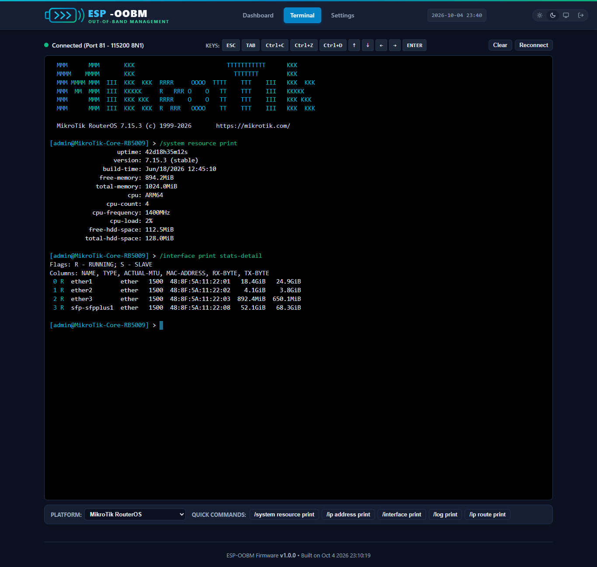
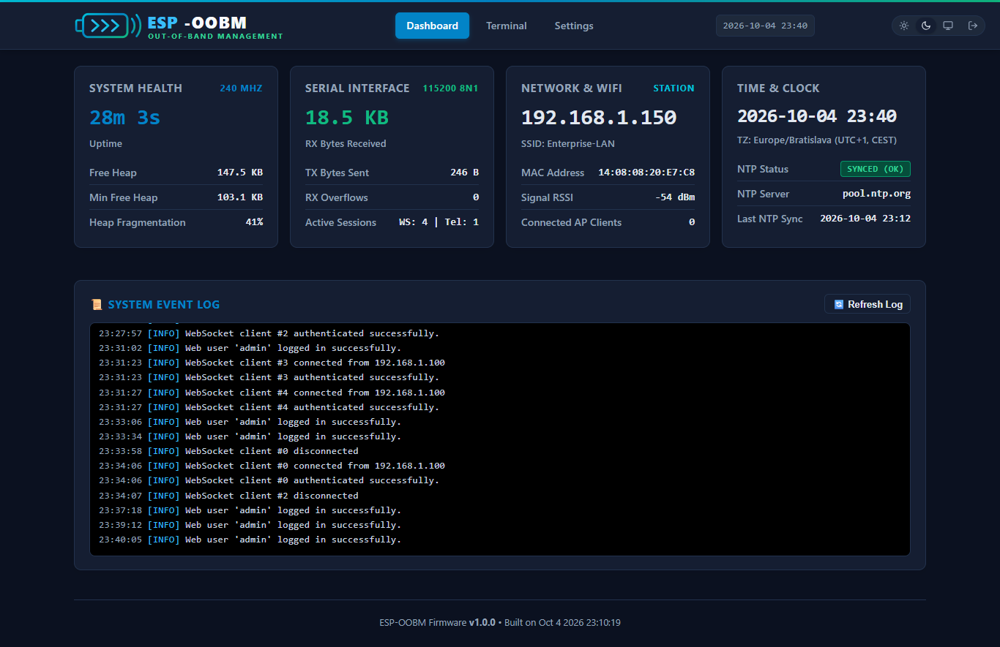
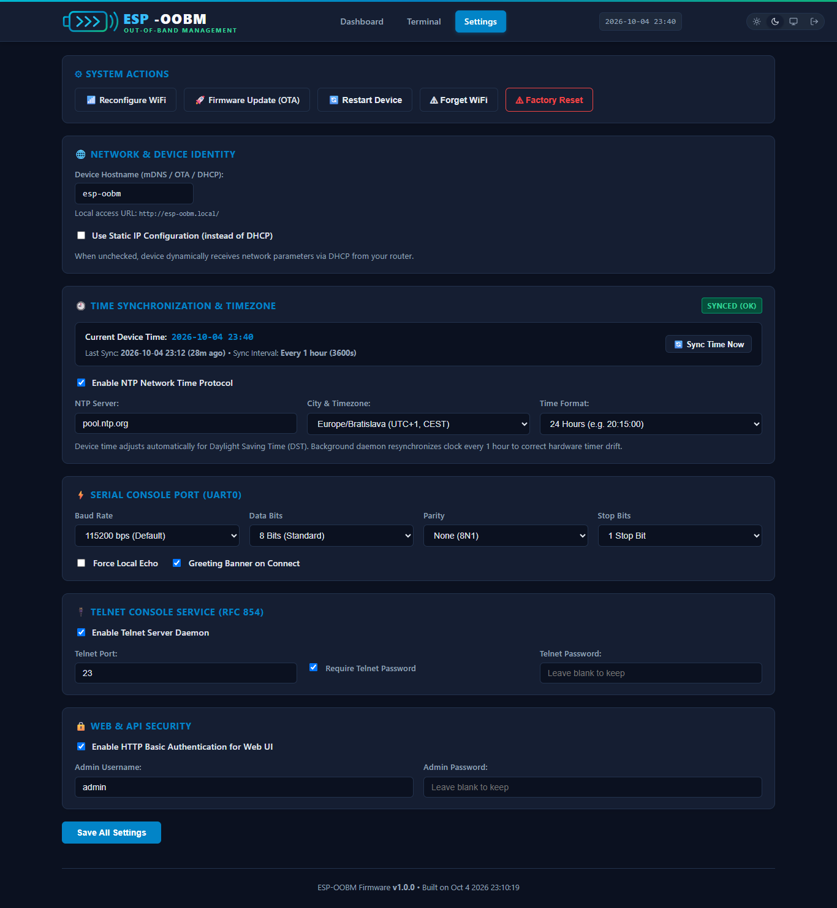
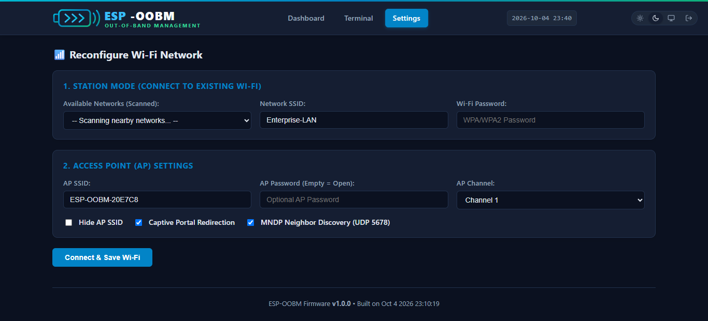
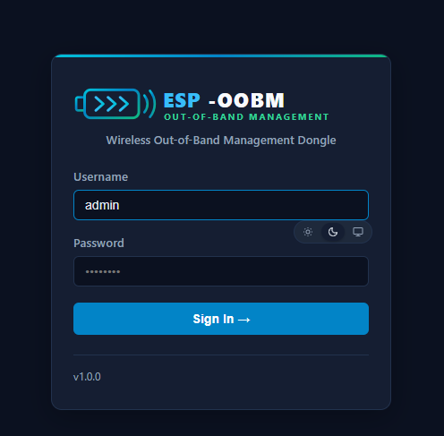

# Web Interface & Terminal Guide

The **ESP-OOBM** web interface provides a high-performance, dark/light themed, responsive browser application designed for emergency out-of-band console access, telemetry monitoring, and device administration directly from any smartphone, tablet, or PC without installing specialized software.

---

## UI Screenshots Showcase

### 1. Interactive Serial WebTerminal (Dark Theme)

Full bi-directional terminal emulator with 16-color ANSI rendering, dedicated macro keys, and RouterOS command quick-actions:

---

### 2. Live Diagnostics Dashboard

Real-time telemetry showing dual-core 240 MHz CPU status, free heap memory, UART bridge throughput, active sessions, Wi-Fi signal strength, and live rolling event logs:

| Dark Theme | Light Theme |
| :---: | :---: |
|  |  |

---

### 3. Device Settings & Wi-Fi Configuration

| System & Security Settings | Wi-Fi Station & AP Setup |
| :---: | :---: |
|  |  |

---

### 4. Authentication Login Screen

Form-based login dialog with animated focus outlines and theme toggle:

  

---

## WebTerminal Features & Operation

The WebTerminal connects directly to the ESP32 WebSocket daemon on port `81` (`ws://<ip>:81`) to deliver real-time, low-latency serial streaming.

### 1. ANSI / VT100 Engine Capabilities
- **16 Standard ANSI Colors**: Renders standard 8 dark + 8 bright foreground and background terminal colors (`#0f172a`, `#ef4444`, `#10b981`, `#f59e0b`, `#3b82f6`, `#a855f7`, `#06b6d4`, `#cbd5e1`, etc.).
- **256-Color & 24-bit TrueColor Palette**: Supports extended RGB escape codes (`\x1b[38;2;r;g;bm`).
- **Cursor Positioning & Clear Sequences**: Full handling of CSI codes (`\x1b[H`, `\x1b[2J`, `\x1b[K`, `\x1b[24;1H`).
- **VT102 Answer-Back**: Responds to device attribute queries (`\x1b[?1;2c`) for compatibility with interactive terminal applications (e.g. `htop`, `mc`, `nano`, `vi`).

### 2. Dedicated Hardware Macro Keys
On touchscreens and mobile keyboards where control keys are inaccessible, the top toolbar provides instant one-tap macro buttons:

| Macro Key | ANSI / Byte Sequence | Description |
| :--- | :--- | :--- |
| **`ESC`** | `0x1B` (`\x1b`) | Escape key (exit menus, command cancellation) |
| **`TAB`** | `0x09` (`\t`) | Auto-completion in RouterOS / Bash / Cisco CLI |
| **`Ctrl+C`** | `0x03` (`\x03`) | Interrupt signal (terminate running command or ping) |
| **`Ctrl+Z`** | `0x1A` (`\x1a`) | Suspend process / exit config submode in Cisco / RouterOS |
| **`Ctrl+D`** | `0x04` (`\x04`) | EOF / Logout from active shell |
| **`↑` / `↓`** | `\x1b[A` / `\x1b[B` | Command history navigation |
| **`←` / `→`** | `\x1b[D` / `\x1b[C` | Cursor line editing |
| **`ENTER`** | `0x0D` (`\r`) | Send carriage return |

### 3. Multi-Platform Command Presets
The bottom toolbar allows selecting target platforms to display quick one-click commands:

- **MikroTik RouterOS**: `/system resource print`, `/ip address print`, `/interface print`, `/log print`, `/ip route print`
- **Linux / OpenWrt**: `ip addr show`, `dmesg | tail -n 20`, `logread -f`, `systemctl status`, `df -h`
- **Cisco IOS**: `show ip interface brief`, `show running-config`, `show interfaces status`, `show logging`, `terminal length 0`
- **pfSense / FreeBSD**: `ifconfig`, `pfctl -d`, `pfctl -e`, `top -b`, `netstat -rn`
- **Generic**: `help`, `status`, `version`, `ping 8.8.8.8`, `reboot`

### 4. Raw Session Persistence
The terminal automatically caches incoming stream data in browser `sessionStorage` (`oobm_term_raw`). When switching tabs between *Dashboard*, *Terminal*, and *Settings*, the full scrollback buffer is instantly restored without losing historical router output.

---

## Theme Switcher (Dark, Light, System)

The top-right header contains a 3-way theme selector:
- ☀️ **Light Theme**: High-contrast clean white layout for outdoor daytime usage.
- 🌙 **Dark Theme**: Dark navy/slate palette (`#0b1120`) optimized for dimly-lit server rooms.
- 💻 **System Theme**: Automatically tracks the OS/browser color scheme (`prefers-color-scheme: dark`) and switches dynamically.

Preference is stored in browser `localStorage.setItem('oobm_theme', ...)` for persistence across reloads.
