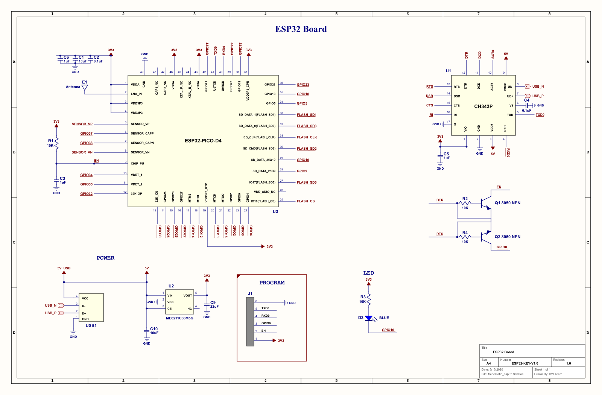

# ESP32 KEY V1.0 - Pinout & Hardware Interconnects

## Interconnect Wiring Table

| ESP32-PICO-D4 Pin | Function | Target Net / Peripheral | Description |
| :--- | :--- | :--- | :--- |
| **GPIO1** | `U0TXD` | CH343P `RXD` (Pin 5) | Serial TX (ESP32 &rarr; USB Host) |
| **GPIO3** | `U0RXD` | CH343P `TXD` (Pin 4) | Serial RX (USB Host &rarr; ESP32) |
| **GPIO10** | `IO10` | Blue LED `D3` (Cathode) | Status LED (Active-LOW: 3.3V &rarr; R3 10k&Omega; &rarr; D3 &rarr; GPIO10) |
| **EN** (`CHIP_PU`) | Reset | Q1 Collector / J1 Pin 2 | Auto-reset from CH343P `DTR`/`RTS` + RC (R1 10k&Omega;, C3 1&mu;F) |
| **GPIO0** | Bootloader | Q2 Collector / J1 Pin 3 | Auto-download from CH343P `DTR`/`RTS` |
| **3V3** | Power | LDO Output (ME6211 Pin 5) | 3.3V System Power Rail |
| **GND** | Ground | Common Ground Plane | System Reference Ground |

> [!NOTE]
> The dongle has **no physical pushbuttons**. Reset (`EN`) and Bootloader (`GPIO0`) are automatically controlled by the dual-transistor auto-download circuit (`Q1`, `Q2` S8050) driven by the CH343P `DTR` and `RTS` control lines.

---

## Programming & Debug Header (J1)

Pads located on the PCB for direct hardware debugging:

| Pin | Net | Description |
| :---: | :--- | :--- |
| **1** | `3V3` | +3.3V Power |
| **2** | `EN` | Chip Enable / Reset |
| **3** | `GPIO0` | Boot Mode Select |
| **4** | `U0RXD` | ESP32 UART0 Receive |
| **5** | `U0TXD` | ESP32 UART0 Transmit |
| **6** | `GND` | Ground |

---

## USB Type-A Plug (USB1)

| Pin | Signal | Target |
| :---: | :--- | :--- |
| **1** | `GND` | Common Ground |
| **2** | `D+` | CH343P `UD+` (Pin 7) |
| **3** | `D-` | CH343P `UD-` (Pin 8) |
| **4** | `VCC` | +5.0V DC to ME6211 LDO `VIN` |
