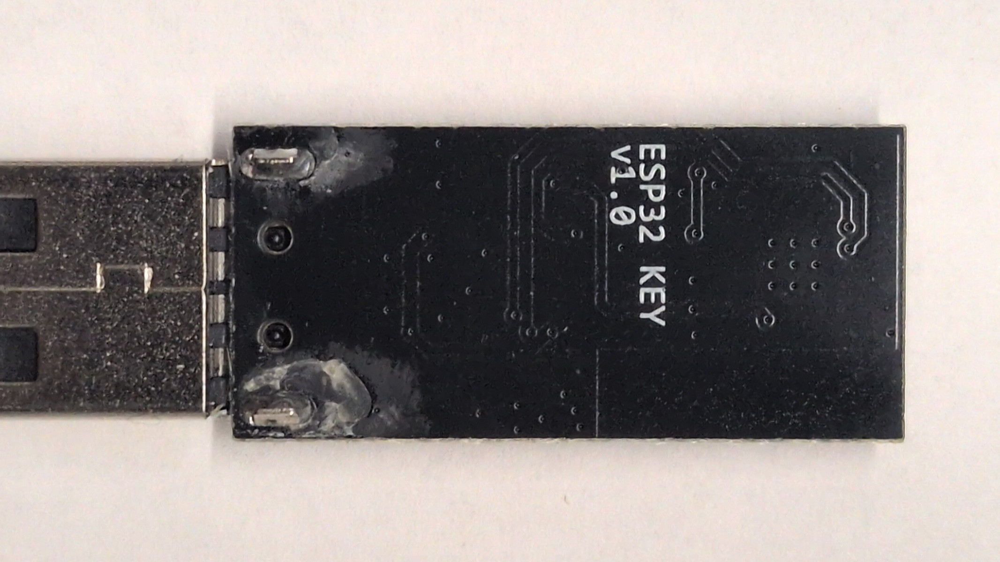
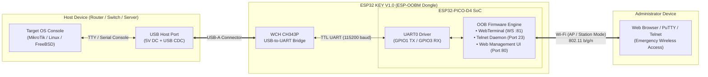

# ESP32 KEY V1.0 - Hardware Specifications

Vector Schematic: [`schematic.svg`](schematic.svg) • High-Res Image: [`schematic.png`](schematic.png) • Pinout: [`PINOUT.md`](PINOUT.md)

## Hardware Photos

| Enclosure View | PCB Top (Components) | PCB Bottom (Silkscreen) |
| :---: | :---: | :---: |
|  |  |  |

---

## Schematic Diagram

---

## Component Summary

| Component | Part / IC | Details |
| :--- | :--- | :--- |
| **SoC / SiP** | Espressif **ESP32-PICO-D4** | Dual-core 240 MHz Xtensa LX6, 4 MB embedded SPI flash, QFN-48 (7×7 mm) |
| **USB-UART Bridge** | WCH **CH343P** | High-speed USB-to-UART bridge controller (up to 6 Mbps baud rate) |
| **Power LDO** | MicrOne **ME6211C33M5G** | 5V &rarr; 3.3V / 500 mA Low Dropout Regulator, SOT-23-5 |
| **Auto-Reset** | 2x **S8050** NPN | `Q1`, `Q2` driven by `DTR` & `RTS` lines (hands-free `esptool` flashing) |
| **Status LED** | Blue 0603 SMD | `D3` connected to `GPIO10` (Active-LOW with 10k&Omega; pull-up to 3.3V) |
| **Host Plug** | USB Type-A Male | Direct insertion into router/switch/server USB host port |
| **Antenna** | 2.4 GHz SMD Ceramic Chip | 2.4 GHz 802.11 b/g/n Wi-Fi + Bluetooth |

---

## Operating Principle

