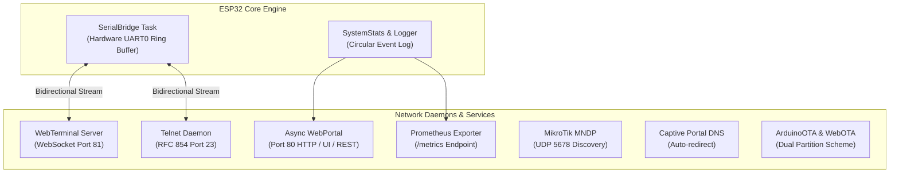

# ESP-OOBM - Firmware Documentation

Firmware architecture, build instructions, REST API reference, and network services for the ESP-OOBM wireless Out-of-Band console bridge.

---

## 1. Software Architecture



### Module Breakdown

| Module | Files | Function |
| :--- | :--- | :--- |
| **SerialBridge** | `SerialBridge.h`, `SerialBridge.cpp` | Non-blocking UART0 ring buffer for low-latency bridging between serial host and wireless network clients. |
| **WebTerminal** | `WebTerminal.h`, `WebTerminal.cpp` | WebSocket-based ANSI terminal engine supporting dynamic platform quick-command bars (MikroTik, Linux, Cisco, pfSense). |
| **TelnetServer** | `TelnetServer.h`, `TelnetServer.cpp` | Standalone RFC 854 Telnet server on port 23 for direct PuTTY, SecureCRT, or Linux `telnet` connections. |
| **WebPortal** | `WebPortal.h`, `WebPortal.cpp` | Single-page responsive dark/light WebUI, Live Dashboard, Wi-Fi Manager, Terminal, System Log, and REST API. |
| **PrometheusExporter** | `PrometheusExporter.h`, `PrometheusExporter.cpp` | Exposes real-time telemetry metrics on `/metrics` for Grafana & Prometheus monitoring. |
| **MndpDiscovery** | `MndpDiscovery.h`, `MndpDiscovery.cpp` | Broadcasts MikroTik Neighbor Discovery Protocol packets so the dongle appears in Winbox / RoMON neighbor lists. |
| **ConsoleLogger** | `ConsoleLogger.h`, `ConsoleLogger.cpp` | In-memory circular log buffer with timestamping and `/api/logs` JSON streaming. |
| **SystemStats** | `SystemStats.h`, `SystemStats.cpp` | Real-time tracking of CPU usage, heap fragmentation, Wi-Fi RSSI, uptime, and UART throughput. |

---

## 2. Build & Flashing Guide

### Prerequisites
* [PlatformIO Core (CLI)](https://platformio.org/install/cli) or [VS Code with PlatformIO IDE extension](https://platformio.org/install/ide?install=vscode)

### Compilation
```powershell
# Navigate to software directory
cd software

# Build firmware binary
pio run -e esp32_pico_d4
```

### USB Flashing (Auto-Reset)
The ESP32 KEY V1.0 board features automatic DTR/RTS flashing via its CH343P USB bridge. No button presses required:
```powershell
pio run -e esp32_pico_d4 -t upload
```

### Flash Partition Layout
Dual OTA partition scheme defined in [`partitions_custom.csv`](partitions_custom.csv) for safe, atomic over-the-air firmware updates:

| Name | Type | SubType | Offset | Size | Purpose |
| :--- | :---: | :---: | :---: | :---: | :--- |
| `nvs` | data | nvs | `0x9000` | 20 KB | Non-volatile settings (Wi-Fi, platform, baud rate) |
| `otadata` | data | ota | `0xe000` | 8 KB | OTA boot selector |
| `app0` | app | ota_0 | `0x10000` | 1920 KB | Firmware Slot 0 (Active / Standby) |
| `app1` | app | ota_1 | `0x1F0000`| 1920 KB | Firmware Slot 1 (Standby / Active) |
| `spiffs` | data | spiffs | `0x3D0000`| 192 KB | Static assets / future storage |

---

## 3. Network Services & Ports

| Service | Port / Protocol | URL / Connection Command |
| :--- | :---: | :--- |
| **Web Dashboard** | HTTP (Port 80) | `http://192.168.4.1/` or `http://esp-oobm.local/` |
| **Web ANSI Terminal** | WebSocket (Port 81) | `http://esp-oobm.local/terminal` |
| **Telnet Daemon** | RFC 854 (Port 23) | `telnet 192.168.4.1 23` |
| **Prometheus Exporter**| HTTP (Port 80) | `http://esp-oobm.local/metrics` |
| **Web OTA Update** | HTTP (Port 80) | `http://esp-oobm.local/update` |
| **MikroTik Discovery** | UDP (Port 5678) | Visible in Winbox &rarr; Neighbors |

---

## 4. REST API Specification

### `GET /api/status`
Returns live system metrics and hardware status.
```json
{
  "cpu_freq": 240,
  "free_heap": 218544,
  "min_free_heap": 204120,
  "heap_frag": 6,
  "uptime_sec": 3482,
  "wifi_mode": "AP_STA",
  "wifi_ssid": "NOC-Infrastructure",
  "wifi_ip": "10.0.50.45",
  "wifi_rssi": -58,
  "ap_clients": 1,
  "uart_baud": 115200,
  "uart_rx_bytes": 142095,
  "uart_tx_bytes": 48312,
  "platform": "mikrotik"
}
```

### `GET /api/logs`
Returns the recent in-memory circular event log.
```json
{
  "logs": [
    {"time": "00:00:01", "level": "INFO", "msg": "Booting ESP-OOBM v1.0.0"},
    {"time": "00:00:02", "level": "INFO", "msg": "Wi-Fi AP started: ESP-OOBM-A1B2C3"},
    {"time": "00:00:04", "level": "INFO", "msg": "Telnet daemon listening on port 23"}
  ]
}
```

### `GET /api/scan`
Triggers an asynchronous Wi-Fi network survey scan and returns detected SSIDs with signal strengths and encryption types.

### `POST /api/platform`
Sets the active CLI quick-command preset for the WebTerminal and persists the choice to NVS flash.
* **Payload**: `p=mikrotik` | `p=linux` | `p=cisco` | `p=pfsense` | `p=generic`

### `POST /api/settings/save`
Saves UART serial configuration (baud rate, parity, stop bits) and NTP timezone settings.

### `POST /api/wifi/save`
Updates Station and AP credentials and switches Wi-Fi operating mode.

### `POST /api/restart`
Initiates a clean soft reboot of the ESP32 microcontroller.

### `POST /api/factory_reset`
Erases all NVS configuration entries and restores default factory AP settings.

---

## 5. WebTerminal Dynamic Platform Presets

The WebTerminal features dedicated, one-touch command bars that adapt to the target host device platform:

* **MikroTik RouterOS**: `/system identity print`, `/ip address print`, `/interface print`, `/log print follow`, `/system reboot`, `/export compact`
* **Linux / OpenWrt**: `ip a`, `systemctl status`, `journalctl -f`, `dmesg -T | tail -n 30`, `top`, `reboot`
* **Cisco IOS / Catalyst**: `show ip int brief`, `show running-config`, `show vlan brief`, `show logging`, `show version`
* **pfSense / FreeBSD / OPNsense**: `ifconfig`, `netstat -rn`, `pfctl -sr`, `tail -f /var/log/system.log`, `top -s 1`
* **Generic**: `help`, `status`, `info`, `clear`, `exit`
